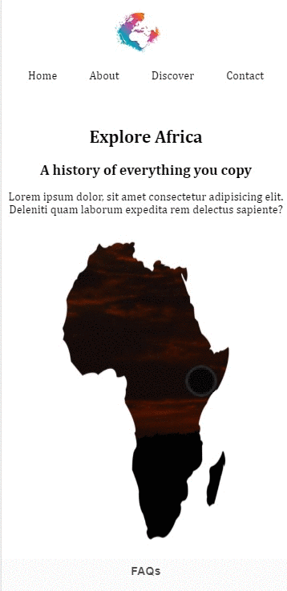

## Explore Africa -Cloning Page

❤️ This project is the Cloning Page. 
 
 
👨‍💻 The main aim of this project is to improve my <b>HTML/CSS skills and ©️cloning abilities</b>.
  
🎯 Challenge is to build out this landing page and get it looking as close to the design as possible..
  
🔗 To see live version 🎯https://tal58.github.io/Explore_Africa/
 

 ⌛ Happy Coding  ✠

  
🌐 The desktop and mobile versions of the web page are as follows;🧭
  

## 🖥️Desktop version
 

 
 
 
 
 
 
 
 
 
         

## 📱Mobile version
 

